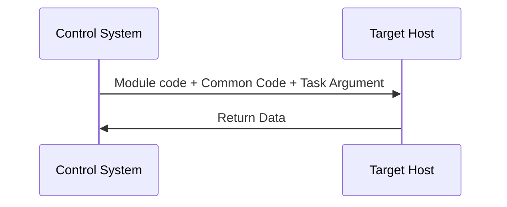

# Presentation

**Ansible** is a lightweight automation tool or more precisely a task execution engine (acquired today by Red Hat but remains an open source project hosted on [Github](https://github.com/ansible)). This tool, written in Python, is here to help us easily perform one or more actions (**tasks**) on one or more computers. These tasks can target:

- The local system Ansible is running from,
- Other systems Ansible can reach over the network (ability to manage a fleet of remote systems at the same time).

The pure concept of Ansible is to answer to our needs by organizing the tasks to be performed in a simple to read text file ("Yet Another Markup Language" formatted file) with reusable and repeatable system. Ansible works through three operation models:

- The linear strategy: it's the default operation model of Ansible that allows to linearly execute a list of tasks: in this way, data generated in one task could be used as the input of the next task.
- The serial strategy: one or more hosts in batches are walked through the task list before looping back to the beginning for the next set of hosts. This operation model suits better when you need to perform tasks in a specific order.
- The free strategy: since Ansible 2.0, there is a third operation model in which machines complete tasks as fast as they individually can without waiting for the rest of the hosts. This operation model suits better when we need to reduce the interruption time.


## Presets

### Installation

There only needs to be one control system (Ansible Control Machine or ACM) where the Ansible engine is installed (the system that will manage itself and other systems in a fleet). Yet, Ansible is not required on the hosts to be managed. The Ansible engine has minimal installation requirements (python 2.6 or later with a few additional libraries up to date).

The use of Microsoft Windows as a control machine is not supported by Ansible.

We will be using a Fedora 31 release (with VIM & Python installed on it) as the Ansible Control Machine. On Fedora, we'll use the built-in package manager dnf to install Ansible with the command:

> sudo dnf install ansible

### Communication

Communication with targeted hosts works (by default) through SSH. The tasks instructions and tasks code are transported through this protocol. Data from the actions (tasks) is returned over SSH as well.

Ansible can be run from any system that has access rights to the target hosts:

- The targeted hosts have to be specified at least in an inventory source file,
- With state directives in a playbook file,
- And the credentials necessary to communicate with the targets.

## Configuration files

In order to let Ansible works, you have to configure different configuration files.

### Inventory

#### The inventory file  

This file provide a set of potential target hosts to execute tasks on. These targets are required for any Ansible action. The inventories are not specifically tied to a set of Ansible instructions: multiple inventories can be used with different tasks.

An inventory is a collection of hosts (optionally sorted into groups) with host names or IP addresses. The inventory files can be organized through 3 ways:

- The simple way: an uncategorized list of host names or IP addresses.
- By groups: as a fleet of machines grows, it's interesting to categorize hosts within groups.
- By subgroups: groups can include other groups building up a hierarchy (for many reasons: such as purpose, locality or operating system).

Hosts or groups are used in patterns as an entity to target or as an entity to skip from within a target. These patterns can be expressed as a single item or collections that are inclusive, exclusive or unioned.

As Ansible supports multiple inventories, an inventory file with the same group can be used many times with different values within each inventory. It allows the possibility to quickly switch from testing in development to deploying in production, simply by changing the inventory option.

#### The Inventory variables

These variables contains data related to a host comprised of key in value pairs. These variables have used all over the place in Ansible.

Variables are also used in templated files. It gives operators the ability to develop flexible and dynamic automation.  

Variables can be expressed:
- Directly in the inventory file alongside the host so that they are specific to that particular inventory.
- In separate files within inventory subdirectories allowing for the same variable data to apply to multiple inventories.

#### The inventory sources

Inventories and the variables associated with them can come from static or dynamic sources:

- Static sources are simple to start with but require manual updates as fleet information changes.
- Ansible provides dynamic inventory scripts to fetch data from Cloud services or other container and VM sources (Docker, VMWare, VirtualBox and Vagrant).

#### The tasks

The action ansible takes on target hosts are called tasks. Tasks are a descriptive bit of YAML code that developers write to provide just enough data and controls for Ansible to be able to complete the desired action.

Data can be considered arguments to an executable script such as:

- The name of a database to create,
- A path of a directory to create.

In task definitions, variables can be used in the task arguments or used in conditional statements (if Ansible should perform or not a certain task). Ansible is also able to determine whether or not the task's intended effect has already been achieved (the status is reflected bu the task returned status which contains information about the task attempt).

The code that tasks use to perform work are called modules (custom modules can be created or already bundled on [Ansible documentation](https://docs.ansible.com/ansible/latest/modules/modules_by_category.html)) . Ansible uses these modules and combines it with common execution code and task argument input to be transported to the target host for execution. Data will be returned back to Ansible.



### Playbook

Playbooks are also YAML formatted files that collect one or more plays. Plays are one or more tasks linked to the hosts that they are to be executed on.

Ansible playbook is the Ansible executable that is used to parse and execute the playbook with the provided inventory. A playbook can be launched with the command:

>ansible-playbook playbook.yml

## How it works

### Creation of an inventory

First, we need to create an inventory. We set up a file (hosts will be the name of the file) with the command:
>vim hosts

This inventory will be a set of hosts in a couple of groups:

```
[groupA]
host1
host2
host3

[groupB]
host4
host5
host6

[all:vars]
ansible_connection=local
```

In this code, we also added a group called "all:vars". It let us define a variable for all the hosts that instructs Ansible to connect to these fake hosts locally.

### Creation of the playbook file

Now, we need to create a playbook file. We set up a file (playbook will be the name of the file) with the command:

>vim playbook.yml  

In order to correctly write a playbook, we have to understand the hierarchy:

```
┌───────────────────────┐
│     Playbook File     │
│  ┌─────────────────┐  │
│  │      Play       │  │
│  │ (Name & Hosts)  │  │
│  │  ┌───────────┐  │  │
│  │  │   Task    │  │  │
│  │  │Name/Module│  │  │
│  │  └───────────┘  │  │
│  └─────────────────┘  │
└───────────────────────┘   

```
If we translate this into code, we have the example below:
```
---
- name: "Do a demo"
  hosts: groupA
  tasks:
	  - name: demo task 1
		debug:
			msg: "this is task 1"
	  - name: demo task 2
	    debug:
		    msg: "this is task 2"

- name: "Do another demo"
  hosts: groupB
  tasks:
	  - name: demo task 3
		debug:
			msg: "this is task 3"
	  - name: demo task 4
	    debug:
		    msg: "this is task 4"
```

The three dashes are here to indicate a YAML file.
Here we create the first play ("name"). Plays requires:

- A name ("Do a demo" for example),
- A host pattern (the groupA or groupB we specified in the inventory file),
- Some tasks (each task should have a name):
		- Inside the task we specify the module we want to use (here we want to use the debug module to display provided text on the screen). The debug module can take a message argument.

Plays are executed from top to bottom. Tasks are also executed from top to bottom.

### Executing the playbook

First, we need to tell through the ansible-playbook command where is the inventory file to use with the argument "-i" and also the playbook file to parse:
> ansible-playbook -i hosts playbook.yml

Each play will be displayed on screen and as each host completes each task, the result is displayed on screen as well.  
